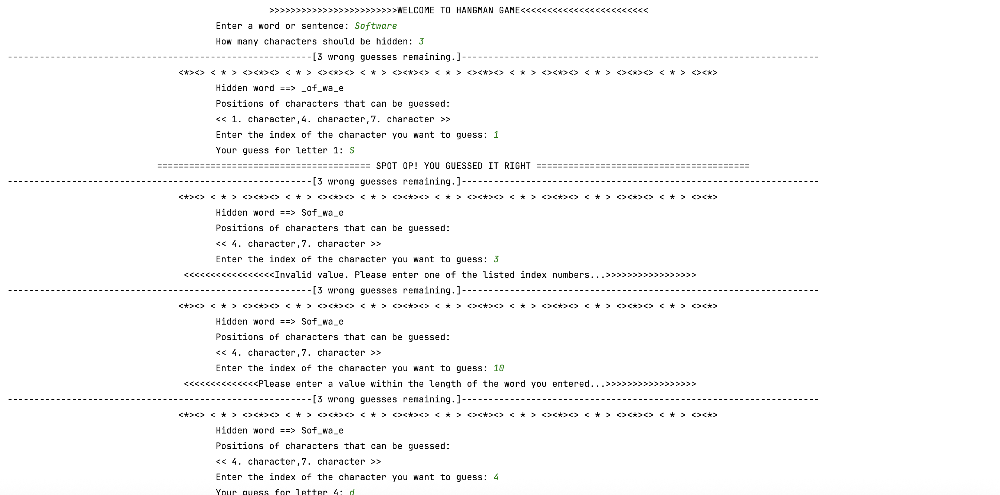
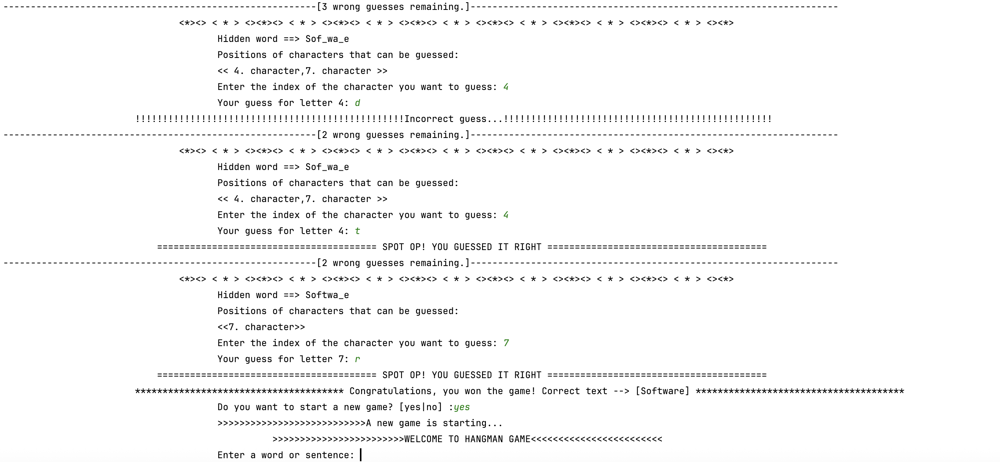

## 🇹🇷 Türkçe

# 🎮 - Adam Asmaca (Konsol Tabanlı Java Oyunu)

Bu, klasik **Adam Asmaca** oyununun **Java** ile yazılmış konsol tabanlı bir uygulamasıdır. Oyuncu bir kelime veya cümle girer, kaç karakterin gizleneceğini belirler ve ardından karakterleri indekslerine göre tahmin etmeye çalışır.

---

## 🧩 Özellikler

- ✅ Konsol tabanlı etkileşim (grafik arayüz yok)
- ✅ Oyuncu, tahmin edilecek kelimeyi veya cümleyi kendisi girer
- ✅ Kullanıcı, kaç karakterin gizleneceğini belirler
- ✅ Her tahminden sonra oyun ilerleyişi gösterilir
- ✅ Tüm girişler doğrulanır (sayı olmayan, aralık dışı değerler vb.)
- ✅ Sınırlı sayıda yanlış tahmin hakkı vardır
- ✅ Yeni bir oyun başlatmak desteklenir
- ✅ Türkçe karakter desteği mevcuttur

---

## 📁 Proje Yapısı

- Hangman/src/Runner.java # Uygulamanın başlatıldığı giriş noktası
- Hangman/src/Try.java # Ek kontrol veya akış mantığı
- Hangman/src/input/InputManager.java # Kullanıcı girişlerini yönetir
- Hangman/src/display/TextDisplay.java # Oyun durumunun ekrana yazdırılmasından sorumludur
- Hangman/src/process/GuessEngine.java # Tahminlerin işlenmesinden sorumlu olan temel mantık
- Hangman/src/util/GamePreparer.java # Karakterleri hazırlar ve gizler
- Hangman/src/var/Defines.java # Global değişkenleri/sabitleri saklar

---

## 🖥️ Konsol çıktısı oyun akışına göre farklılık gösterebilir. Aşağıdaki ekran görüntüleri yalnızca örnek senaryoları göstermektedir.

---
## 🌍 English

# 🎮 - Hangman (Console-Based Java Game)

This is a console-based implementation of the classic **- Hangman** game written in **Java**. The game allows a player to input a word or sentence, specify how many characters should be hidden, and then guess the hidden characters by index.

---

## 🧩 Features

- ✅ Console-based interaction (no GUI)
- ✅ Player provides the input word or sentence
- ✅ User specifies how many characters will be hidden
- ✅ Game displays progress after each guess
- ✅ Validates all inputs (non-integer, out-of-bounds, etc.)
- ✅ Limited number of wrong guesses
- ✅ Supports replaying a new game
- ✅ Includes Turkish character support

---

## 📁 Project Structure

- Hangman/src/Runner.java # Entry point of the application
- Hangman/src/Try.java # Additional control or flow logic
- Hangman/src/input/InputManager.java # Handles user input
- Hangman/src/display/TextDisplay.java # Responsible for displaying game state
- Hangman/src/process/GuessEngine.java # Core logic for processing guesses
- Hangman/src/util/GamePreparer.java # Prepares and hides characters
- Hangman/src/var/Defines.java # Stores global variables/constants

## 🖥️ The console output will differ depending on the game flow. The screenshot below shows just one example scenario

