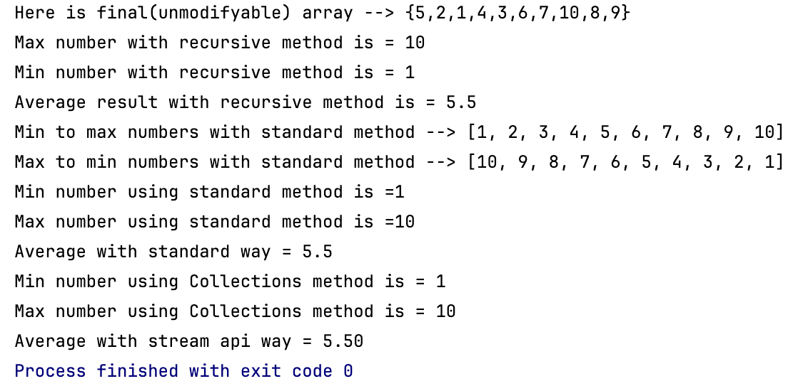

## 🇹🇷 Türkçe
# MathCalcsWithArrays

Bu Java projesi, sabit uzunluklu bir tamsayı dizisi üzerinde çeşitli matematiksel işlemleri farklı programlama yaklaşımlarıyla (standart döngüler, rekürsif fonksiyonlar, koleksiyonlar ve Stream API) gerçekleştirmektedir.

## 🎯 Amaç

Bu projenin amacı; Java dilinde farklı algoritma teknikleri kullanarak aynı işlemleri gerçekleştirme becerisini geliştirmek, karşılaştırmalı olarak öğrenmeyi kolaylaştırmak ve kod okuma-yazma alışkanlığını artırmaktır.

## 📌 Sabit Dizi

İşlemlerde kullanılan dizi `vars/Definitions.java` sınıfında sabit olarak tanımlanmıştır(numberArray)

> **Not:** Kullanıcıdan veri alınmaz, tüm işlemler bu sabit dizi ile gerçekleştirilir.

## 📁 Proje Yapısı
- src/Runner.java                          # Programın başlangıç noktası (main metodu)
- src/vars/Definitions.java                # Sabitler ve global değişkenler
- src/types/WithStandard.java              # Standart döngüler ile hesaplamalar
- src/types/WithRecursive.java             # Rekürsif fonksiyonlar ile işlemler
- src/types/WithCollections.java           # Koleksiyonlar (List, Set) ile işlemler
- src/types/WithStreamAPI.java             # Java Stream API kullanımı
- src/data/initialize/Initialize.java      # (Bu proje özelinde kullanılmamaktadır)
- src/data/display/Display.java            # Dizi ve sonuçların ekrana yazdırılması

## Program çalıştırıldığında console görünümü aşağıdaki ekran görüntüsüne benzer çıktıyla oluşmalıdır

## 🌍 English
# MathCalcsWithArrays

This Java project performs various mathematical operations on a fixed-length integer array using different programming approaches such as standard loops, recursive functions, Java Collections, and the Stream API.

## 🎯 Purpose

The goal of this project is to develop the ability to implement the same operations using different algorithmic techniques in Java, facilitate comparative learning, and improve code reading and writing skills.

## 📌 Fixed Array

The array used in operations is statically defined in the `vars/Definitions.java` class (`numberArray`).

> **Note:** No input is taken from the user; all operations are performed using this fixed array.

## 📁 Project Structure

- src/Runner.java                          # Entry point of the program (main method)
- src/vars/Definitions.java                # Constants and global variables
- src/types/WithStandard.java              # Calculations using standard loops
- src/types/WithRecursive.java             # Calculations using recursive functions
- src/types/WithCollections.java           # Calculations using Java Collections (List, Set)
- src/types/WithStreamAPI.java             # Calculations using Java Stream API
- src/data/initialize/Initialize.java      # (Not used in this particular project)
- src/data/display/Display.java            # Responsible for printing arrays and results to the console

## When the program is run, the console output should look similar to the following screenshot:

