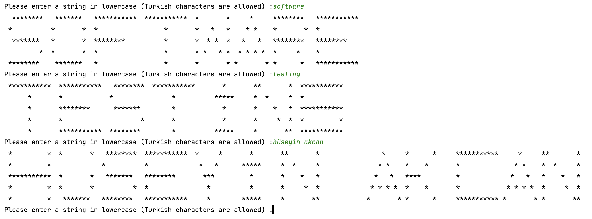

The program reads a lowercase string input (including Turkish characters) and displays each letter as a star-shaped representation in the console.

The console output may look like the screenshot below
